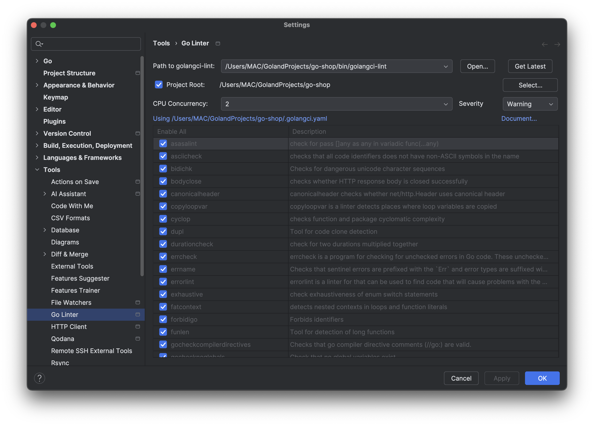

```
├── app                           # Входная точка приложения
│   └── main.go                   # Главный файл
├── api                           # API протоколы
│   └── swagger                   # Папка для Swagger
│       └── api                   # Сгенерированная Swagger документация
│           ├── swagger.json     # JSON спецификация API
│           ├── swagger.yaml     # YAML спецификация API
│           └── docs.go          # Go файл с встроенной документацией
├── docs                          # Устаревшая папка (перенесено в api/swagger/api)
├── bin                           # Бинарники нужные при разработке
│   └── golangci-lint             # Линтер 
├── config                        # Конфигурационные файлы приложения
│   └── config.go                 # Основной конфигурационный файл
├── delivery                      # Обработка HTTP-запросов и middleware
│   ├── handlers                  # HTTP-хендлеры для обработки запросов
│   ├── middleware                # Middleware для Echo
│   │   └── wrappers              # Вспомогательные обертки
├── internal                      # Основная бизнес-логика (закрыто для внешнего использования)
│   ├── data                      # Работа с данными
│   │   └── repository            # Реализация репозиториев
│   ├── domain                    # Сущности домена и интерфейсы
│   │   ├── entities              # Сущности (models)
│   │   ├── enums                 # Перечисления
│   │   └── repository            # Интерфейсы для репозиториев
│   └── usecase                   # Реализация бизнес-логики
├── pkg                           # Общие пакеты
│   ├── constants                 # Константы проекта
│   ├── database                  # Работа с базой данных
│   │   ├── postgreSQL.go         # Подключение PostgreSQL
│   │   └── migrations            # SQL-файлы для миграций
│   ├── di                        # Dependency Injection контейнер
│   │   └── di_container.go       # Регистрация зависимостей
│   └── utils                     # Утилиты 
├── scripts                       # Скрипты для сборки и развертывания
├── .env                          # Файл с переменными окружения
└── go.mod                        # Go-модуль с зависимостями
```

# Описание компонентов структуры проекта

## cmd
- **main.go**: Это главный файл, который запускает приложение. Здесь происходит инициализация Echo, настройка маршрутов, подключение к базе данных и другие важные процессы. Он обычно содержит `main()` функцию, откуда начинается выполнение.

## configs
- Директория для хранения конфигурационных файлов, которые могут использоваться для настройки приложения (например, файлы `.yaml`, `.json` для конфигурации базы данных, API и других параметров).

### delivery
  Этот слой отвечает за взаимодействие с внешним миром. Основные компоненты:
  - **handlers:** HTTP-хендлеры, которые принимают запросы от клиентов, валидируют их, вызывают методы слоя usecase и возвращают ответы.
  - **midleware:** Промежуточные обработчики для запросов, такие как:
	- Аутентификация.
	- Логирование.
	- Обработка ошибок.
  - **wrappers:** Дополнительные обертки для удобства работы с middleware.

## internal
  Содержит бизнес-логику и код, скрытый от внешнего использования.
  - **domain:**
	- entities: Определяет сущности (модели), используемые в бизнес-логике. Например, User, Product, Order и др.
	- enums: Содержит перечисления.
	- repository: Интерфейсы для взаимодействия с хранилищем данных.
  - **usecase:**
	- Реализует бизнес-логику приложения, связывая запросы от слоя delivery с хранилищем данных (repository).
	- Здесь описываются сценарии работы, например: регистрация пользователя, создание заказа и т.д.
  - **data:**
	- repository: Реализация репозиториев, где происходит работа с базой данных (CRUD-операции).

## pkg
  Содержит вспомогательные и общие модули.
  - **constants:**
	- Здесь хранятся глобальные константы, такие как параметры конфигурации, сообщения об ошибках и другие общие значения.
  - **database:**
	- postgreSQL.go: Модуль для подключения к базе данных PostgreSQL.
	- migrations: Директория с SQL-файлами для управления структурой базы данных.
  - **di:**
	- di_container.go: Регистрация зависимостей через Dependency Injection (DI).
  - **error_handling:**
	- error_response.go: Единая структура для представления ошибок API
	- errors.go: Предопределенные ошибки приложения
	- log.go: Логирование ошибок с трейсингом
  - **utils:**
	Вспомогательные функции и модули, например:
	- Обработка ошибок.
	- Форматирование данных.
	- Валидация.

## scripts
- Скрипты для автоматизации сборки, развертывания и других процессов, которые могут упростить разработку и развертывание приложения.

## .env
- Файл, в котором хранятся переменные окружения, используемые в приложении, такие как параметры подключения к базе данных, API-ключи и другие конфигурационные данные.

## go.mod
- Файл модуля Go, который содержит информацию о зависимостях проекта. Этот файл позволяет управлять версиями пакетов и упрощает управление зависимостями.

# Стэк технологий 
- **DI** - Uber Dig
- **Logging** - Logrus
- **Database** - PostgreSQL
- **Migrations** - Goose 
- **Cache** - Redis
- **API Documentation** - Swagger (swaggo)
- **Web Framework** - Echo

# Документация по запуску проекта

## Установка PostgreSQL

1. **Установка PostgreSQL**
   Установите PostgreSQL на вашу систему:
  - **На MacOS**:
    ```bash
    brew install postgresql
    ```
  - **На Ubuntu**:
    ```bash
    sudo apt update
    sudo apt install postgresql postgresql-contrib
    ```
  - **На Windows**:
    Скачайте установочный файл с [официального сайта PostgreSQL](https://www.postgresql.org/download/) и выполните установку.

2. **Запуск PostgreSQL**
   Убедитесь, что PostgreSQL запущен:
  - **На MacOS**:
    ```bash
    brew services start postgresql
    ```
  - **На Ubuntu**:
    ```bash
    sudo systemctl start postgresql
    ```
  - **На Windows**:
    PostgreSQL обычно запускается автоматически.

## Настройка пользователя и базы данных

1. **Вход в PostgreSQL:**
   Войдите в консоль PostgreSQL под пользователем `postgres`:
   ```bash
   psql -U postgres
   ```
   ```bash
    sudo -u postgres psql
    ```
2.	**Создание пользователя:**
    Выполните команду для создания нового пользователя:

       ```bash
       CREATE USER marketplace WITH PASSWORD '12345';
       ```
3. **Создание базы данных:** Создайте базу данных для проекта:

    ```bash
    CREATE DATABASE "go-shop" OWNER marketplace;
    ```
   
### Альтернатива:

1.	**Создание пользователя:**
Выполните команду для создания нового пользователя:

       ```bash
       createuser -s marketplace
       ```
2. **Создание базы данных:** Создайте базу данных для проекта:

    ```bash
    createdb go-shop 
    ```

## Установка goose

1.	**Установить goose глобально:** Если у вас установлен Go, выполните команду для установки goose:

      ```bash
      go install github.com/pressly/goose/v3/cmd/goose@latest
      ```

      Это добавит бинарный файл goose в ваш _**GOPATH/bin**_. Убедитесь, что **_GOPATH/bin_** добавлен в переменную окружения **_$PATH_**.
      Чтобы проверить, установился ли goose, выполните:

      ```bash
      goose --version
      ```

2. **Миграция базы данных:** См. **CLI COMMANDS**, команда 1.

# CLI Commands
## Миграции

- #### Применить все миграции
    Применяет все недостающие миграции, начиная с текущей версии базы данных.
```bash
  goose -dir pkg/database/migrations postgres "host=localhost port=5432 user=marketplace password=12345 dbname=go-shop sslmode=disable" up
```

- #### Откатить последнюю миграцию 
     Откатывает последнюю примененную миграцию.
```bash
  goose -dir pkg/database/migrations postgres "host=localhost port=5432 user=marketplace password=12345 dbname=go-shop sslmode=disable" down
```

- #### Откатить все миграции
    Возвращает базу данных в исходное состояние, удаляя все миграции.
```bash
  goose -dir pkg/database/migrations postgres "host=localhost port=5432 user=marketplace password=12345 dbname=go-shop sslmode=disable" reset
```
- #### Применить одну миграцию
    Применяет только одну следующую миграцию.
```bash
  goose -dir pkg/database/migrations postgres "host=localhost port=5432 user=marketplace password=12345 dbname=go-shop sslmode=disable" up-by-one
```

- #### Откатить миграции до определенной версии
    Откатывает миграции до указанной версии.
```bash
  goose -dir pkg/database/migrations postgres "host=localhost port=5432 user=marketplace password=12345 dbname=go-shop sslmode=disable" down-to <target_version>
```

- #### Список миграций
    Показывает текущую версию базы данных и список всех миграций.
```bash
  goose -dir pkg/database/migrations postgres "host=localhost port=5432 user=marketplace password=12345 dbname=go-shop sslmode=disable" status
```

- #### Перейти к конкретной миграции
    Применяет или откатывает миграции для достижения указанной версии.
```bash
  goose -dir pkg/database/migrations postgres "host=localhost port=5432 user=marketplace password=12345 dbname=go-shop sslmode=disable" goto <target_version>
```

- #### Создать новую миграцию
    Создает новый файл миграции с указанным именем.
```bash
  goose -dir pkg/database/migrations create <migration_name> sql
```

## Swagger документация

### Установка Swagger CLI
Установите инструмент для генерации Swagger документации:
```bash
go install github.com/swaggo/swag/cmd/swag@latest
```

### Генерация документации
Сгенерируйте Swagger документацию из аннотаций в коде:
```bash
make swagger
```
или
```bash
swag init -g app/main.go -o api/swagger/api
```

### Просмотр документации
После запуска сервера документация доступна по адресу:
- **Swagger UI**: http://localhost:8080/swagger/index.html
- **JSON спецификация**: http://localhost:8080/swagger/doc.json

### Структура ошибок
API использует единую структуру для ошибок `ErrorResponse` из пакета `errorhandling`:
```go
type ErrorResponse struct {
    Code    int    `json:"code"`    // HTTP статус-код
    Details string `json:"details"` // Сообщение для пользователя
    Err     error  `json:"-"`       // Внутренняя ошибка (не отправляется клиенту)
}
```

### Аннотации Swagger
Все хендлеры содержат аннотации Swagger для автоматической генерации документации:
```go
// @Summary Создать пользователя
// @Description Регистрирует нового пользователя в системе
// @Tags users
// @Accept json
// @Produce json
// @Param user body entities.User true "Данные пользователя"
// @Success 201 {object} entities.User
// @Failure 400 {object} errorhandling.ErrorResponse
// @Router /users [post]
```

## GIT
Настраиваем git hooks
```bash
  make setup-githooks
```
## Linter

```bash
  make install-linter
```
Устонавливаем
- Go Linter в GoLand https://plugins.jetbrains.com/plugin/12496-go-linter
- VsCode надо дополнить

Открываем **Settings...** > **Tools** > **Go Linter**<br>
- Добавляем Path для линтера в папке go-shop/bin/golangci-lint<br>
- Устонавливаем Project Root наш проект 
- И ставим Severity - warning

- Применяем измениния<br>
Все тперь анализатор в IDE должен работать коректно

``P.s  Go Lint тут нормально не работает, поэтому было принято решения использовать линтер чере терминал``
```bash
    make lint
```


